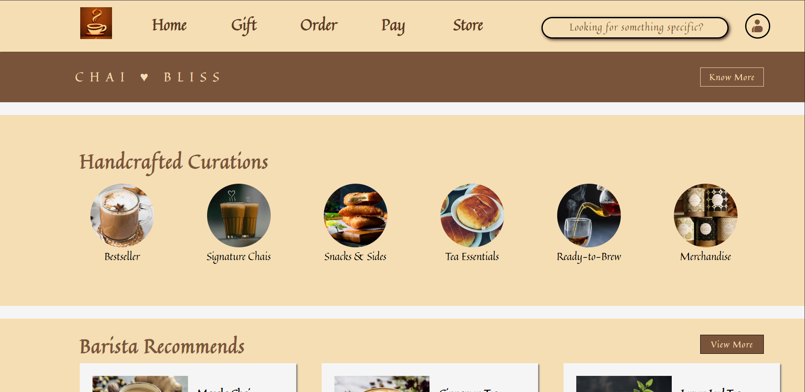
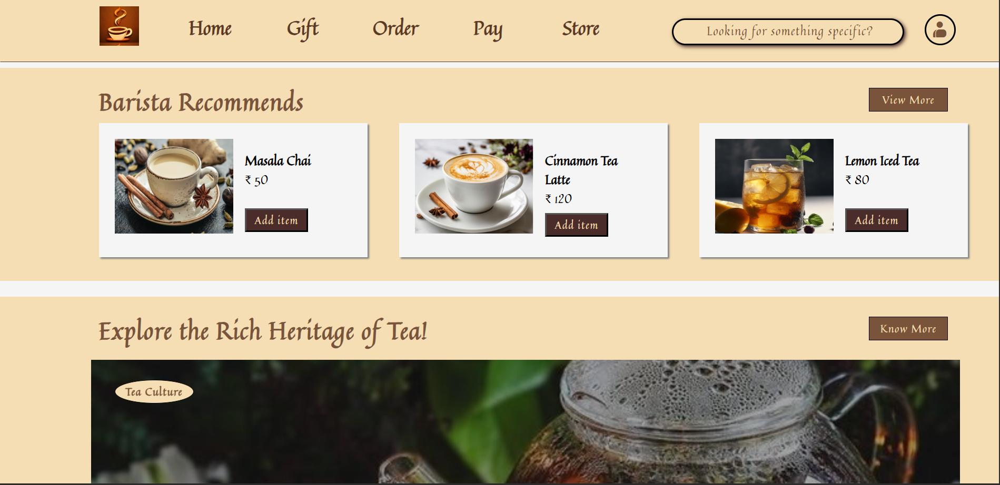
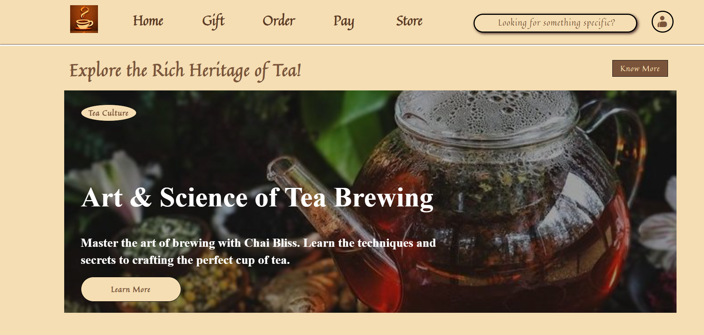
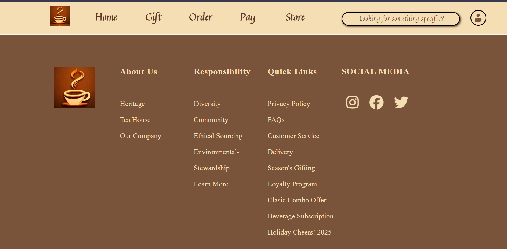

# ☕ Chai Bliss Website

A tea-themed landing page inspired by modern beverage brand websites. Chai Bliss showcases handcrafted tea collections, curated recommendations, tea culture, and a clean user-friendly interface built using HTML and CSS.

## 🚀 Live Demo

🔗 https://kriisshhnnaa.github.io/chai-bliss-website/

---

## 📖 Project Overview

Chai Bliss is a static front-end website developed as part of my web development learning journey. The project focuses on creating an aesthetically pleasing tea brand website with a structured layout, attractive visuals, and organized content sections.

---

## 🖼️ Project Screenshots

### Homepage & Navigation


### Barista Recommendations


### Tea Heritage Section


### Footer Section


---

## ✨ Features

- Elegant tea-themed UI design
- Navigation bar with menu options
- Search bar interface
- Handcrafted tea collections showcase
- Barista recommended products section
- Tea culture and heritage section
- Informative footer with quick links
- Organized and visually appealing layout

---

## 🛠️ Technologies Used

- HTML5
- CSS3

---

## 📂 Project Structure

```text
chai-bliss-website
│
├── index.html
├── style.css
├── Chai Pictures/
├── home-page.png
├── recommendations.png
├── heritage-section.png
├── footer-section.png
└── README.md
```

---

## 🎯 Learning Outcomes

Through this project, I learned:

- Structuring web pages using HTML
- Styling layouts with CSS
- Working with images and visual assets
- Designing landing pages
- Creating reusable UI sections
- Deploying projects using GitHub Pages

---

## 👨‍💻 Author

**Krishna Tuwar**

EXTC Engineering Student  
Learning Web Development | JavaScript | MERN Stack | AWS Cloud Practitioner

---
⭐ Feel free to explore the project and provide feedback.
